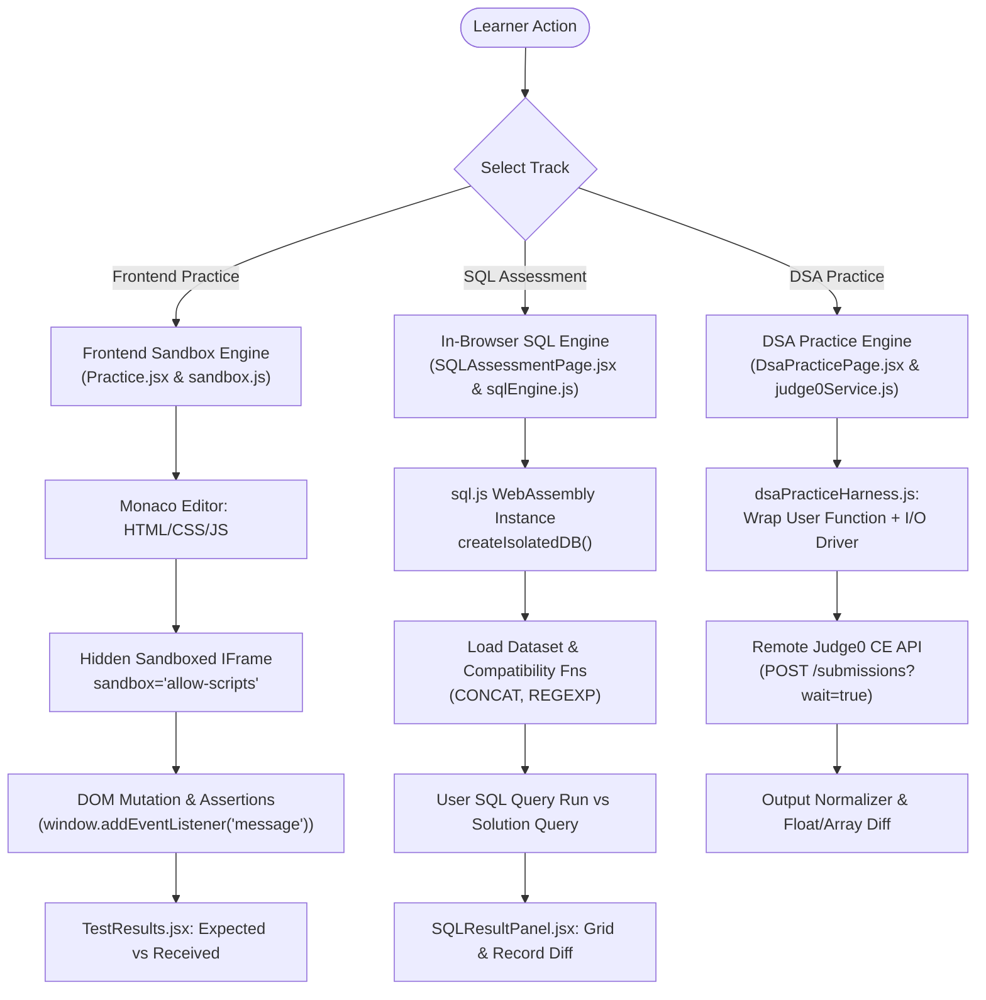
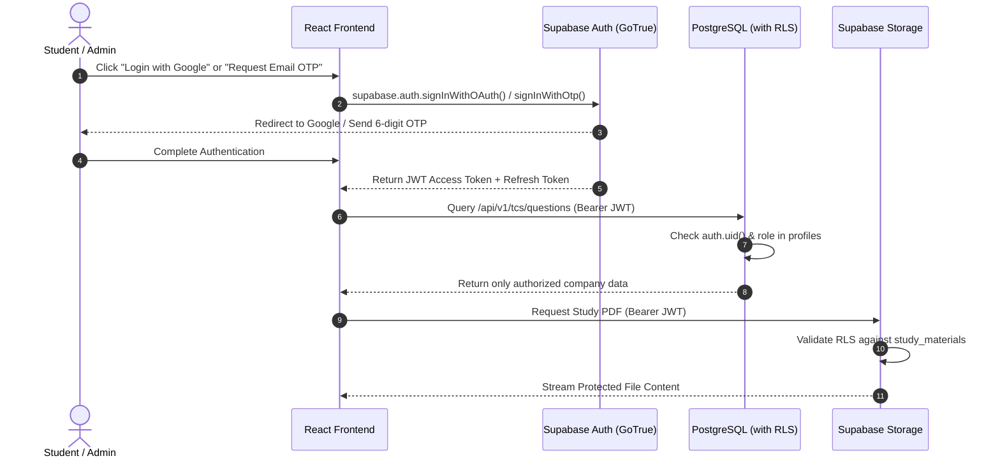
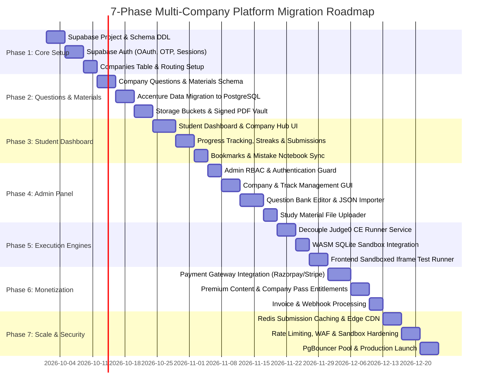

# 🌐 Multi-Company Technical Assessment & Placement Preparation Platform
## Comprehensive Architecture, Engineering Specification & Implementation Roadmap

> **Document Version:** 2.0.0  
> **Target Audience:** Engineering Leads, Full-Stack Architects, Product Developers, DevOps  
> **Status:** Architecture Reference & Multi-Tenant Blueprint  
> **Reference Repository:** [Accenture Ready](file:///d:/Project/Accenture)

---

## 📑 Table of Contents

1. [Executive Summary & Project Overview](#1-executive-summary--project-overview)
2. [Existing Codebase Architecture Analysis](#2-existing-codebase-architecture-analysis)
   - [2.1 Technology Stack in Use](#21-technology-stack-in-use)
   - [2.2 Core Execution & Assessment Engines](#22-core-execution--assessment-engines)
   - [2.3 State Management & Offline Persistence](#23-state-management--offline-persistence)
   - [2.4 Express & WebSocket Presence Server](#24-express--websocket-presence-server)
3. [Complete Directory & File Structure](#3-complete-directory--file-structure)
4. [Company-Wise Content Isolation Architecture](#4-company-wise-content-isolation-architecture)
   - [4.1 Multi-Tenant Isolation Principles](#41-multi-tenant-isolation-principles)
   - [4.2 Company Routing & Context Provider Pattern](#42-company-routing--context-provider-pattern)
   - [4.3 Common Reusable Services vs Company-Specific Assets](#43-common-reusable-services-vs-company-specific-assets)
5. [Database Architecture & Recommendation](#5-database-architecture--recommendation)
   - [5.1 Technology Comparison: MongoDB vs PostgreSQL vs Supabase](#51-technology-comparison-mongodb-vs-postgresql-vs-supabase)
   - [5.2 Chosen Database Solution & Justification](#52-chosen-database-solution--justification)
   - [5.3 Production Database Schema (PostgreSQL / Supabase DDL)](#53-production-database-schema-postgresql--supabase-ddl)
6. [Cloud Asset & File Storage Architecture](#6-cloud-asset--file-storage-architecture)
   - [6.1 Storage Evaluation: AWS S3 + CloudFront vs Cloudflare R2 vs Supabase Storage](#61-storage-evaluation-aws-s3--cloudfront-vs-cloudflare-r2-vs-supabase-storage)
   - [6.2 Chosen Storage Architecture](#62-chosen-storage-architecture)
   - [6.3 Bucket Taxonomy, Access Policies & Presigned URLs](#63-bucket-taxonomy-access-policies--presigned-urls)
7. [Authentication & Security Architecture](#7-authentication--security-architecture)
   - [7.1 Authentication Evaluation: Supabase Auth vs Clerk vs Auth0 vs Custom JWT](#71-authentication-evaluation-supabase-auth-vs-clerk-vs-auth0-vs-custom-jwt)
   - [7.2 Chosen Auth Architecture: Supabase Auth + RLS](#72-chosen-auth-architecture-supabase-auth--rls)
   - [7.3 Role-Based Access Control (RBAC) & Permission Matrix](#73-role-based-access-control-rbac--permission-matrix)
   - [7.4 Session Lifecycle & Token Management](#74-session-lifecycle--token-management)
8. [Common vs. Company-Specific Matrix](#8-common-vs-company-specific-matrix)
9. [RESTful & Service API Architecture](#9-restful--service-api-architecture)
   - [9.1 Public & Student Endpoints](#91-public--student-endpoints)
   - [9.2 Common Execution Engine Gateway](#92-common-execution-engine-gateway)
   - [9.3 Admin Management Endpoints](#93-admin-management-endpoints)
10. [UI/UX & Responsive Multi-Device Design](#10-uiux--responsive-multi-device-design)
    - [10.1 Desktop/Laptop Layout (Split-Panel / Workspace UI)](#101-desktoplaptop-layout-split-panel--workspace-ui)
    - [10.2 Tablet Layout (Adaptive Drawer & Dual-Pane)](#102-tablet-layout-adaptive-drawer--dual-pane)
    - [10.3 Mobile Layout (Bottom Navigation & Collapsible Drawers)](#103-mobile-layout-bottom-navigation--collapsible-drawers)
    - [10.4 Shared UI Component Library vs Company Skins](#104-shared-ui-component-library-vs-company-skins)
11. [How to Add a New Company (TCS, Infosys, Wipro, Cognizant, HCL)](#11-how-to-add-a-new-company-tcs-infosys-wipro-cognizant-hcl)
    - [11.1 Admin Panel Flow (Zero Code)](#111-admin-panel-flow-zero-code)
    - [11.2 Developer / Seed Data Flow](#112-developer--seed-data-flow)
12. [Scalability, Performance & Security Guidelines](#12-scalability-performance--security-guidelines)
    - [12.1 Code Execution Sandboxing & Rate Limiting](#121-code-execution-sandboxing--rate-limiting)
    - [12.2 Caching Strategy (Redis & Edge CDN)](#122-caching-strategy-redis--edge-cdn)
    - [12.3 Multi-Tenant Database Query Performance](#123-multi-tenant-database-query-performance)
13. [Step-by-Step Implementation & Migration Roadmap](#13-step-by-step-implementation--migration-roadmap)

---

## 1. Executive Summary & Project Overview

The current repository represents **Accenture Ready**, a rich browser-based training and assessment platform equipped with:
- **Interactive In-Browser Frontend Sandbox**: Monaco Editor, DOM execution within sandboxed iframes, and automated unit test assertion feedback.
- **In-Memory SQL Assessment Engine**: Powered by WebAssembly (`sql.js`), enabling students to run interactive DDL/DML queries against question-specific relational schemas client-side.
- **Multi-Language DSA Code Execution Service**: Connected to the Judge0 Community Edition (CE) REST API across Python, Java, C++, C#, and JavaScript with custom test harness generation.
- **Timed Technical & PYQ Mock Testing**: 30+ question banks, previous year question (PYQ) mock papers, cognitive mini-games (Memory Maze, Math Bubble), pseudocode evaluation, and cloud/networking certifications.
- **Real-Time Presence**: An Express 5 + WebSocket server broadcasting active live learner counts across sessions.

### Modernization & Multi-Company Transformation
While the current application is hardcoded around Accenture placement patterns, the ambition of this technical specification is to transform the system into an **Enterprise-Grade Multi-Company Assessment Platform** supporting companies such as:
- **TCS** (Ninja, Digital, Prime: NQT Cognitive, Advanced Coding, TCS-specific MCQs)
- **Infosys** (SP & DSE Coding, Pseudo-code, Verbal & Mathematical Abilities)
- **Accenture** (Cognitive, Technical MCQs, MS Office, Cloud/Network Security, Coding)
- **Wipro** (Elite NLTH: Essay, Quants, Logical, Coding)
- **Cognizant** (GenC, GenC Elevate, GenC Next: Skill-based programming, Debugging)
- **HCL / Capgemini / Tech Mahindra** (Company-specific patterns and domain MCQs)

### Golden Rule of Multi-Tenancy
> **Strict Content Isolation**: Under no circumstances should questions, exam configurations, answer keys, solutions, or syllabus taxonomies of one company bleed into or be merged with another company. Each company must operate within its own logically isolated namespace, while sharing high-performance execution engines (Judge0, SQLite WASM, Frontend DOM Sandbox).

---

## 2. Existing Codebase Architecture Analysis

### 2.1 Technology Stack in Use

| Tier | Current Technology | Role in Codebase |
|:---|:---|:---|
| **Frontend Framework** | React 19 (`react` 19.2.8, `react-dom` 19.2.8) | Modern component architecture, hooks-based UI state |
| **Build Tooling** | Vite 8 (`vite` 8.2.2, `@vitejs/plugin-react`) | Rapid HMR, optimized ESM bundling |
| **Routing** | React Router DOM v7 (`react-router-dom` 7.18.3) | Client-side routing with deep link fallback |
| **Code Editor** | Monaco Editor (`@monaco-editor/react` 4.7.0) | Multi-tab code editor with syntax highlighting and auto-completion |
| **Styling** | Vanilla CSS (`index.css` ~227KB, `App.css`) | Custom design system, dark/light theme tokens, responsive utilities |
| **Icons & UI** | `lucide-react` (1.42.0), `react-hot-toast` | Crisp SVG icons and accessible notification toasts |
| **In-Browser SQL** | `sql.js` (1.14.2) + `sql-wasm.wasm` | WebAssembly SQLite3 database instance in the browser |
| **DSA Execution** | Judge0 CE REST API (`judge0Service.js`) | Remote code compilation & execution in sandboxed Docker workers |
| **Backend / WS** | Express 5 (`express` 5.2.1) + `ws` (8.21.3) | Production static asset server + real-time visitor presence |
| **Metadata / SEO** | `react-helmet-async` (3.0.0) | Dynamic page titles, meta descriptions, and OpenGraph tags |

---

### 2.2 Core Execution & Assessment Engines

The current platform implements three distinct assessment engines:



1. **Frontend DOM Sandbox Engine (`src/pages/Practice.jsx`, `src/utils/sandbox.js`)**:
   - Compiles a complete HTML bundle injecting user HTML, user CSS, user JS, and automated DOM testing scripts.
   - Embeds this in a sandboxed `<iframe>` with strict `allow-scripts` privileges.
   - The test script queries elements via `document.querySelector`, triggers synthetic events (`click`, `input`, `change`), and verifies DOM mutations.
   - Results are communicated back to React via `window.parent.postMessage`.

2. **In-Browser SQLite WASM Engine (`src/utils/sqlEngine.js`, `src/pages/SQLAssessmentPage.jsx`)**:
   - Downloads `sql-wasm.wasm` lazily.
   - For every question, spins up an ephemeral `new sqlInstance.Database()`.
   - Polyfills MySQL-compatible functions (`CONCAT`, `REGEXP`) directly into SQLite.
   - Seeds tables from schema definitions in `src/data/sqlSchemas.js` and question datasets.
   - Runs both candidate query and reference solution, comparing column names, row counts, and value tuples with floating-point tolerance.

3. **DSA Code Execution Engine (`src/services/judge0Service.js`, `src/services/dsaPracticeHarness.js`)**:
   - Supports 5 programming languages: Python (3.8.1, ID 71), Java (OpenJDK 13, ID 62), C++ (GCC 9.2, ID 54), C# (Mono 6.6, ID 51), and JavaScript (Node.js 12, ID 63).
   - Injects the user's algorithm code into a language-specific harness that reads test case inputs from `dsaTestCases.js`, invokes the solution method, and serializes outputs.
   - Sends submissions to `https://ce.judge0.com/submissions?wait=true`.
   - Normalizes whitespace, trailing zeroes, and structural JSON differences via `outputsMatch()`.

---

### 2.3 State Management & Offline Persistence

All client-side persistence is currently handled via specialized browser `localStorage` utilities:
- `storage.js`: Tracks candidate code bundles (`frontend-practice-bundle-q{id}`), active question IDs, theme (`dark`/`light`), and completion statuses.
- `sqlStorage.js`: Persists in-progress SQL editor drafts and question pass histories.
- `bookmarksStorage.js`: Maintains user-bookmarked questions across all topic tracks.
- `mistakesStorage.js`: Automatically records incorrect submissions with timestamps, user answers, and error logs for revision.
- `gamificationService.js`: Tracks streaks, XP, badges, daily challenge milestones, and readiness scores.

---

### 2.4 Express & WebSocket Presence Server

Located under `server/`:
- `server/index.js`: Sets up an Express 5 server that serves static production assets from `dist/`, handles SPA client-side fallback, and mounts the WebSocket presence server.
- `server/presenceServer.js`: Manages real-time visitor heartbeats (`ping`/`pong`), computes active concurrent learners across channels, and exposes live counters to the frontend via `src/hooks/useLiveViewer.js`.

---

## 3. Complete Directory & File Structure

```text
Accenture/
├── docs/                                  # Architectural & project documentation
│   └── README.md                          # This comprehensive blueprint specification
├── public/                                # Public static assets
│   ├── favicon.svg                        # Site favicon
│   ├── sql-wasm.wasm                      # SQLite WebAssembly binary
│   └── ...                                # OpenGraph images & icons
├── scripts/                               # Data aggregation & scraper build tools
│   ├── buildCompleteNetworkData.js        # Network question pipeline
│   ├── buildNetworkSecurityData.js        # Security MCQ build script
│   └── generateNetworkQuestions.js        # Automation generator
├── server/                                # Backend services (Express + WebSockets)
│   ├── index.js                           # Express 5 entrypoint, static server & API proxy
│   └── presenceServer.js                  # WebSocket real-time presence tracker
├── src/                                   # Frontend Application Source
│   ├── assets/                            # SVG illustrations & icons
│   ├── components/                        # Shared & modular React components
│   │   ├── cloud/                         # Cloud assessment sub-components
│   │   ├── cognitive/                     # Cognitive assessment widgets
│   │   ├── interview/                     # Interview simulator UI
│   │   ├── java/                          # Java learning pathway widgets
│   │   ├── pseudocode/                    # Pseudocode evaluation widgets
│   │   ├── sql/                           # SQL Editor, ResultPanel, TestResults
│   │   │   ├── SQLEditor.jsx              # Monaco-powered SQL editor
│   │   │   ├── SQLQuestionPanel.jsx       # Problem description & schema tables
│   │   │   ├── SQLResultPanel.jsx         # Query result grid preview
│   │   │   ├── SQLResultsModal.jsx        # Pass/fail summary modal
│   │   │   └── SQLTestResults.jsx         # Test case verification panel
│   │   ├── BeautifiedExplanation.jsx     # Markdown/Syntax highlighted answers
│   │   ├── CodeEditor.jsx                 # Multi-file frontend editor (HTML/CSS/JS)
│   │   ├── ErrorBoundary.jsx              # React runtime error boundary
│   │   ├── GlobalSearchModal.jsx          # Cmd+K universal search modal
│   │   ├── Header.jsx                     # Practice workspace header & action buttons
│   │   ├── LiveViewer.jsx                 # Real-time concurrent learner indicator
│   │   ├── Navbar.jsx                     # Main top navigation bar & mobile menu
│   │   ├── Navigation.jsx                 # Previous/Next problem controls
│   │   ├── PreviewPanel.jsx               # Sandboxed iframe display for frontend
│   │   ├── QuestionDropdown.jsx           # Question jump dropdown
│   │   ├── QuestionPanel.jsx              # Left description panel for frontend tasks
│   │   ├── QuestionSidebar.jsx            # Drawer list of challenges
│   │   ├── ResetModal.jsx                 # Reset code confirmation dialog
│   │   ├── SEO.jsx                        # react-helmet-async SEO wrapper
│   │   ├── SolutionViewer.jsx             # Reference solution viewer modal
│   │   ├── TestResults.jsx                # Unit test execution status panel
│   │   └── Timer.jsx                      # Countdown assessment timer
│   ├── config/                            # Global configurations
│   │   └── seo.js                         # Page-specific meta tags & keywords
│   ├── data/                              # Static question banks & PYQ datasets (~2.5MB)
│   │   ├── cheatSheets.js                 # Revision cheatsheets
│   │   ├── cloudFundamentalsPyq.json      # Cloud PYQ exam bank
│   │   ├── cloudQuestions.js              # Cloud & AWS/Azure MCQs
│   │   ├── cloudSecurityQuestions.js      # Cloud security questions
│   │   ├── computerNetworkPyq.json        # Networking PYQ exam bank
│   │   ├── dailyChallenges.js             # Daily practice schedule & problems
│   │   ├── devopsQuestions.js             # CI/CD & DevOps questions
│   │   ├── dsaOptimalSolutions.js         # Reference code solutions
│   │   ├── dsaOsSqlMcq.json               # OS & DBMS MCQ bank
│   │   ├── dsaPatterns.js                 # Algorithmic pattern guides
│   │   ├── dsaPracticeQuestions.js        # 100+ DSA coding questions
│   │   ├── dsaTestCases.js                # Hidden & public test cases for Judge0
│   │   ├── importantQuestions.js          # High-yield PYQ Set 1
│   │   ├── importantQuestionsSet2.js      # High-yield PYQ Set 2
│   │   ├── interviewQuestions.js          # HR & Technical interview flashcards
│   │   ├── javaTopics.js                  # Core Java concepts & quizzes
│   │   ├── mixedPyq.json                  # Multi-topic mock exam bank
│   │   ├── msOfficePyqFull.json           # MS Office (Excel/Word/PowerPoint) PYQs
│   │   ├── msOfficeQuestions.js           # MS Office practice MCQs
│   │   ├── networkQuestions.js            # Computer Networks MCQs
│   │   ├── networkSecurityCloudPyq.json   # NetSec + Cloud PYQ exam bank
│   │   ├── networkSecurityQuestions.js    # Network security practice MCQs
│   │   ├── oopQuestions.js                # Object-Oriented Programming MCQs
│   │   ├── pseudocodeQuestions.js         # Bitwise & flow pseudocode MCQs
│   │   ├── pyqBanks.js                    # PYQ catalog metadata
│   │   ├── questions.js                   # 10 Frontend DOM challenges
│   │   ├── recentQuestions.js             # Recently reported company questions
│   │   ├── sqlQuestions.js                # 50+ relational SQL problems
│   │   ├── sqlSchemas.js                  # Table schemas & mock datasets
│   │   └── wifiSecurityQuestions.js       # Wireless security practice MCQs
│   ├── games/                             # Cognitive assessment game logic
│   │   ├── MathBubble/                    # Rapid speed-math calculation game
│   │   └── MemoryMaze/                    # Visual spatial memory game
│   ├── hooks/                             # Custom React hooks
│   │   └── useLiveViewer.js               # WebSocket presence connection hook
│   ├── pages/                             # 38 Routed application pages
│   │   ├── AchievementsPage.jsx           # Badges, XP & unlockables
│   │   ├── AnalyticsPage.jsx              # Radar charts & performance analysis
│   │   ├── BookmarksPage.jsx              # Saved questions directory
│   │   ├── CheatSheetsPage.jsx            # Quick revision cards
│   │   ├── CloudAssessmentPage.jsx        # Cloud test simulator
│   │   ├── CloudSecurityPage.jsx          # Cloud security topic track
│   │   ├── CognitiveDashboard.jsx         # Cognitive game portal
│   │   ├── CognitiveResults.jsx           # Cognitive game scoring
│   │   ├── DailyChallengePage.jsx         # Daily streak solver
│   │   ├── Dashboard.jsx                  # Main user progress dashboard
│   │   ├── DevOpsAssessmentPage.jsx       # DevOps test track
│   │   ├── DsaPatternsPage.jsx            # Pattern-based learning (Sliding Window, etc.)
│   │   ├── DsaPracticePage.jsx            # Full DSA code editor + Judge0 integration
│   │   ├── FullAssessmentPage.jsx         # Combined multi-section exam
│   │   ├── FullCognitiveMock.jsx          # Timed cognitive mock test
│   │   ├── Home.jsx                       # Platform landing page & features
│   │   ├── ImportantQuestionsPage.jsx     # High-yield questions Set 1
│   │   ├── ImportantQuestionsSet2Page.jsx # High-yield questions Set 2
│   │   ├── InterviewPrepPage.jsx          # Behavioral & tech interview simulator
│   │   ├── JavaLearningPage.jsx           # Java deep dive module
│   │   ├── LearningHubPage.jsx            # Central course curriculum catalog
│   │   ├── MathBubblePage.jsx             # Math bubble game container
│   │   ├── MemoryMazePage.jsx             # Memory maze game container
│   │   ├── MistakesPage.jsx               # Revision notebook for failed questions
│   │   ├── MockAssessmentPage.jsx         # Custom mock exam generator
│   │   ├── MsOfficeAssessmentPage.jsx     # MS Office mock assessment
│   │   ├── NetworkAssessmentPage.jsx      # Computer networking test page
│   │   ├── NetworkSecurityPage.jsx        # Network security test page
│   │   ├── OopAssessmentPage.jsx          # OOP concepts & test simulator
│   │   ├── Practice.jsx                   # Frontend DOM assessment workspace
│   │   ├── PreparationRoadmapPage.jsx     # 30-day prep guide
│   │   ├── PseudocodePage.jsx             # Pseudocode calculation test
│   │   ├── PYQExamPage.jsx                # Exam-style timed mock interface
│   │   ├── RecentQuestionsPage.jsx        # Dated interview questions
│   │   ├── ScoreHistoryPage.jsx           # Past test attempt history
│   │   ├── SQLAssessmentPage.jsx          # Interactive SQL workspace & WASM engine
│   │   ├── TechnicalAssessmentPage.jsx    # 45-question timed mock exam
│   │   └── WifiSecurityPage.jsx           # Wireless security test simulator
│   ├── services/                          # Business logic & execution services
│   │   ├── bookmarksStorage.js            # Bookmarks local storage manager
│   │   ├── dsaPracticeHarness.js          # Code generator for Judge0 runners
│   │   ├── gamificationService.js         # Streak, badge, and XP calculator
│   │   ├── judge0Service.js               # Judge0 API client & output comparator
│   │   ├── mistakesStorage.js             # Failed question persistence manager
│   │   ├── mockTestService.js             # Random mock test generator
│   │   ├── readinessEngine.js             # Probability of selection algorithm
│   │   ├── recommendationEngine.js        # Next best problem algorithm
│   │   ├── technicalMcqEngine.js          # Technical MCQ scoring & timers
│   │   └── telemetryService.js            # User interaction event logger
│   ├── styles/                            # Additional modular styles
│   ├── utils/                             # Utility functions & storage abstractions
│   │   ├── achievements.js                # Achievement definitions
│   │   ├── audio.js                       # Web Audio API sound effects for games
│   │   ├── cloudSecurityStorage.js        # Topic test storage
│   │   ├── cloudStorage.js                # Cloud test score storage
│   │   ├── cognitiveStorage.js            # Cognitive game score storage
│   │   ├── confirmToast.jsx               # Reusable confirmation toast UI
│   │   ├── devopsStorage.js               # DevOps test score storage
│   │   ├── dsaCodeTemplates.js            # Boilerplate starter templates
│   │   ├── importantQuestionsSet2Storage.js
│   │   ├── importantQuestionsStorage.js
│   │   ├── javaStorage.js
│   │   ├── msOfficeStorage.js
│   │   ├── networkSecurityStorage.js
│   │   ├── networkStorage.js
│   │   ├── oopStorage.js
│   │   ├── pseudocodeStorage.js
│   │   ├── sandbox.js                     # IFrame DOM sandbox builder
│   │   ├── sqlEngine.js                   # sql.js WASM singleton & DB isolation
│   │   ├── sqlFormatter.js                # SQL query beautifier
│   │   ├── sqlMarkdown.js                 # Markdown parser for explanations
│   │   ├── sqlStorage.js                  # SQL progress storage
│   │   ├── storage.js                     # Base localStorage helper
│   │   ├── visitorSession.js              # Session identifier generator
│   │   └── wifiSecurityStorage.js
│   ├── App.css                            # Core layout styles
│   ├── App.jsx                            # Main router, route definitions & theme
│   ├── index.css                          # Primary CSS design system (227KB)
│   └── main.jsx                           # Application DOM mount
├── .gitignore
├── .oxlintrc.json                         # Fast JS/React linter config
├── index.html                             # Single Page Application HTML shell
├── package.json                           # Dependencies & run scripts
├── render.yaml                            # Render deployment configuration
├── vercel.json                            # Vercel SPA routing rewrite config
└── vite.config.js                         # Vite build configuration
```

---

## 4. Company-Wise Content Isolation Architecture

### 4.1 Multi-Tenant Isolation Principles

To prevent any content leakage between companies, we implement a **Strict Logical Namespace Architecture**:

```mermaid
graph TD
    Client[Browser Client] --> Router[React Router: /:companySlug/*]
    Router --> Context[CompanyContext: Active Company Metadata]

    Context --> Hub[Company Isolated Hub]
    
    subgraph Accenture Namespace [accenture]
        ACC_Q[Accenture Questions]
        ACC_MOCK[Cognitive + Tech MCQ]
        ACC_DOCS[Accenture Study Material]
    end

    subgraph TCS Namespace [tcs]
        TCS_Q[TCS Digital / NQT Coding]
        TCS_MOCK[TCS Cognitive & Advanced]
        TCS_DOCS[TCS Study Material]
    end

    subgraph Infosys Namespace [infosys]
        INF_Q[Infosys SP/DSE Coding]
        INF_MOCK[Infosys Pseudocode & Logic]
        INF_DOCS[Infosys Study Material]
    end

    Hub --> Accenture Namespace
    Hub --> TCS Namespace
    Hub --> Infosys Namespace

    %% Shared Platform Engines
    ACC_Q -.-> Judge0[Shared Judge0 DSA Runner]
    TCS_Q -.-> Judge0
    INF_Q -.-> Judge0

    ACC_Q -.-> SQL[Shared SQLite WASM Sandbox]
    TCS_Q -.-> SQL
    INF_Q -.-> SQL

    ACC_Q -.-> DOM[Shared Frontend DOM Engine]
    TCS_Q -.-> DOM
    INF_Q -.-> DOM
```

#### Core Invariants
1. **No Shared Content Tables or Mixed Files**: Company questions must never reside in a generic unstructured array without explicit foreign key constraints or namespace tagging.
2. **Deterministic URL Namespacing**: Every route representing company-specific content is prefixed with the company slug:
   - `/:companySlug/dashboard`
   - `/:companySlug/dsa`
   - `/:companySlug/sql`
   - `/:companySlug/mock-test`
   - `/:companySlug/study-material`
3. **Database-Level Row Level Security (RLS)**: Even if a malicious request attempts to query data from `tcs` with an `accenture` token, PostgreSQL RLS policies block unauthorized row retrieval at the database engine level.

---

### 4.2 Company Routing & Context Provider Pattern

The frontend architecture introduces a `CompanyProvider` wrapping company routes:

```jsx
// src/context/CompanyContext.jsx
import React, { createContext, useContext, useEffect, useState } from 'react';
import { useParams, useNavigate } from 'react-router-dom';
import { getCompanyBySlug } from '../services/companyService';

const CompanyContext = createContext(null);

export function CompanyProvider({ children }) {
  const { companySlug } = useParams();
  const navigate = useNavigate();
  const [company, setCompany] = useState(null);
  const [loading, setLoading] = useState(true);

  useEffect(() => {
    let isMounted = true;
    async function loadCompany() {
      setLoading(true);
      const data = await getCompanyBySlug(companySlug);
      if (!data) {
        navigate('/companies', { replace: true });
        return;
      }
      if (isMounted) {
        setCompany(data);
        setLoading(false);
      }
    }
    loadCompany();
    return () => { isMounted = false; };
  }, [companySlug, navigate]);

  if (loading) {
    return <div className="loading-spinner">Loading {companySlug.toUpperCase()} Portal...</div>;
  }

  return (
    <CompanyContext.Provider value={{ company, companySlug }}>
      {children}
    </CompanyContext.Provider>
  );
}

export const useCompany = () => useContext(CompanyContext);
```

---

### 4.3 Common Reusable Services vs Company-Specific Assets

```text
┌────────────────────────────────────────────────────────────────────────┐
│                   REUSABLE PLATFORM SERVICES (COMMON)                  │
├────────────────────────────────┬───────────────────────────────────────┤
│ • Judge0 Multi-Language Runner │ Compiles Python, Java, C++, C#, JS    │
│ • SQLite WASM Sandbox          │ Client-side browser SQL execution     │
│ • Frontend DOM Test Engine     │ Sandboxed IFrame assertion runner     │
│ • Monaco Editor Wrapper        │ Syntax highlighting, themes, shortcuts │
│ • Gamification & Streak Engine │ Daily XP, streaks, level progression  │
│ • Telemetry & Event Logger     │ Activity tracking, timing metrics     │
│ • Realtime WebSocket Presence  │ Concurrent online learner stats       │
│ • Global Auth & Session Vault  │ JWT tokens, user profiles, RBAC      │
└────────────────────────────────┴───────────────────────────────────────┘
                                   │
                                   ▼
┌────────────────────────────────────────────────────────────────────────┐
│               COMPANY-SPECIFIC ISOLATED CONTENT (TENANT)               │
├────────────────┬───────────────────────────────────────────────────────┤
│ Accenture Track│ • 45-Q Technical MCQs (Cloud, NetSec, MS Office)      │
│                │ • Cognitive Games (Math Bubble, Memory Maze)          │
│                │ • Pseudocode bitwise & conditional questions          │
├────────────────┼───────────────────────────────────────────────────────┤
│ TCS Track      │ • TCS NQT Cognitive (Numerical, Verbal, Reasoning)    │
│                │ • TCS Digital/Prime Advanced Coding Challenges        │
│                │ • TCS Specific System Architecture MCQs               │
├────────────────┼───────────────────────────────────────────────────────┤
│ Infosys Track  │ • Infosys SP & DSE Coding Challenges                  │
│                │ • Pseudo-code Interpretation Tests                    │
│                │ • Verbal Ability & Puzzle Solving Sets                │
├────────────────┼───────────────────────────────────────────────────────┤
│ Cognizant/Wipro│ • GenC / GenC Next Debugging & Automata Challenges    │
│                │ • Elite NLTH Essay, Aptitude & Coding Modules         │
└────────────────┴───────────────────────────────────────────────────────┘
```

---

## 5. Database Architecture & Recommendation

### 5.1 Technology Comparison: MongoDB vs PostgreSQL vs Supabase

| Criteria | MongoDB (NoSQL) | Self-Hosted PostgreSQL | **Supabase (Managed PostgreSQL)** |
|:---|:---|:---|:---|
| **Data Integrity & Foreign Keys** | Weak (Application-level enforcement) | Strong (Strict ACID relational schema) | **Strong** (Relational ACID + Foreign Keys) |
| **Multi-Tenancy Isolation** | Scoped queries via `companyId` (Risk of developer query omission) | Row-Level Security (RLS) or Separate Schemas | **Row-Level Security (RLS)** built into the engine |
| **Complex Assessment Schemas** | Flexible for varied question formats, poor relational joins for tests | Excellent JSONB support + relational integrity | **Best of Both Worlds**: Relational tables + `JSONB` |
| **Auth Integration** | None (Requires custom JWT or third-party) | None (Requires custom auth server) | **Built-in Supabase Auth** with GoTrue, OAuth & RLS |
| **File Storage** | GridFS (Slow, unoptimized for video/PDF) | None (Requires separate AWS S3) | **Built-in S3-compatible Supabase Storage** |
| **Realtime Capabilities** | Mongo Change Streams (Complex setup) | Logical replication / WAL parsing | **Built-in Realtime WebSockets** (Postgres Changes) |
| **Maintenance & Operational Overhead** | Moderate | High (Backups, patches, scaling, connections) | **Near Zero** (Fully managed, auto-scaling) |
| **Pricing / Cost Efficiency** | Atlas free tier limited | VPS costs + maintenance | **Generous Free Tier** + predictable Pro pricing |

---

### 5.2 Chosen Database Solution & Justification

### 🏆 Recommendation: **Supabase (PostgreSQL with Row-Level Security + JSONB)**

#### Why Supabase Wins for This Project:
1. **Native Multi-Tenant Isolation via RLS**: We can enforce `WHERE company_id = ...` at the database kernel level. Even if an engineer writes `SELECT * FROM questions`, the database ensures only questions for the user's active tenant are returned.
2. **Hybrid Relational + JSONB Power**:
   - Structured relations for `companies`, `users`, `assessments`, `submissions`.
   - Semi-structured `JSONB` columns for variable test-case matrices, AST trees, DOM assertion configurations, and SQL schemas.
3. **Integrated Auth & File Storage**: Supabase unifies Identity (Google OAuth, OTP, JWT) with Storage (PDFs, study notes) and Data under one permission model.
4. **Instant API Generation**: Generates type-safe REST and GraphQL APIs directly from the schema, drastically reducing boilerplate backend code.

---

### 5.3 Production Database Schema (PostgreSQL / Supabase DDL)

The complete SQL schema below enforces company isolation, role-based access control, question banks, submissions, and study materials:

```sql
-- ============================================================================
-- 1. EXTENSIONS & ENUMS
-- ============================================================================
CREATE EXTENSION IF NOT EXISTS "uuid-ossp";
CREATE EXTENSION IF NOT EXISTS "pgcrypto";

CREATE TYPE user_role AS ENUM ('student', 'admin', 'creator');
CREATE TYPE question_type AS ENUM ('coding_dsa', 'coding_frontend', 'sql', 'mcq', 'pseudocode');
CREATE TYPE difficulty_level AS ENUM ('easy', 'medium', 'hard');
CREATE TYPE submission_status AS ENUM ('passed', 'failed', 'runtime_error', 'time_limit_exceeded');

-- ============================================================================
-- 2. TENANCY: COMPANIES TABLE
-- ============================================================================
CREATE TABLE public.companies (
    id UUID PRIMARY KEY DEFAULT uuid_generate_v4(),
    slug VARCHAR(50) UNIQUE NOT NULL,            -- e.g., 'accenture', 'tcs', 'infosys'
    name VARCHAR(100) NOT NULL,                  -- e.g., 'Accenture', 'Tata Consultancy Services'
    logo_url TEXT,
    primary_color VARCHAR(20) DEFAULT '#6C2CE0',
    description TEXT,
    syllabus_summary JSONB DEFAULT '{}'::jsonb,
    is_active BOOLEAN DEFAULT true,
    created_at TIMESTAMP WITH TIME ZONE DEFAULT NOW(),
    updated_at TIMESTAMP WITH TIME ZONE DEFAULT NOW()
);

-- ============================================================================
-- 3. USER PROFILES (Linked to Supabase auth.users)
-- ============================================================================
CREATE TABLE public.profiles (
    id UUID PRIMARY KEY REFERENCES auth.users(id) ON DELETE CASCADE,
    email VARCHAR(255) UNIQUE NOT NULL,
    full_name VARCHAR(150),
    avatar_url TEXT,
    role user_role DEFAULT 'student',
    target_company_id UUID REFERENCES public.companies(id) ON DELETE SET NULL,
    created_at TIMESTAMP WITH TIME ZONE DEFAULT NOW(),
    updated_at TIMESTAMP WITH TIME ZONE DEFAULT NOW()
);

-- ============================================================================
-- 4. LEARNING TRACKS & TOPICS (Isolated by Company)
-- ============================================================================
CREATE TABLE public.company_tracks (
    id UUID PRIMARY KEY DEFAULT uuid_generate_v4(),
    company_id UUID NOT NULL REFERENCES public.companies(id) ON DELETE CASCADE,
    title VARCHAR(150) NOT NULL,                 -- e.g., 'Cognitive Assessment', 'Digital Coding'
    slug VARCHAR(100) NOT NULL,
    description TEXT,
    order_index INT DEFAULT 0,
    created_at TIMESTAMP WITH TIME ZONE DEFAULT NOW(),
    UNIQUE(company_id, slug)
);

-- ============================================================================
-- 5. QUESTIONS REPOSITORY (Strictly Isolated by Company)
-- ============================================================================
CREATE TABLE public.questions (
    id UUID PRIMARY KEY DEFAULT uuid_generate_v4(),
    company_id UUID NOT NULL REFERENCES public.companies(id) ON DELETE CASCADE,
    track_id UUID REFERENCES public.company_tracks(id) ON DELETE SET NULL,
    title VARCHAR(255) NOT NULL,
    slug VARCHAR(255) NOT NULL,
    type question_type NOT NULL,
    difficulty difficulty_level DEFAULT 'medium',
    tags TEXT[] DEFAULT ARRAY[]::TEXT[],
    problem_statement TEXT NOT NULL,
    constraints TEXT,
    starter_code JSONB DEFAULT '{}'::jsonb,      -- { "javascript": "...", "python": "...", "html": "...", "css": "..." }
    solution_code JSONB DEFAULT '{}'::jsonb,     -- Reference solutions
    explanation TEXT,
    
    -- Engine-Specific Configurations
    test_cases JSONB DEFAULT '[]'::jsonb,        -- [{ "input": "...", "expected": "...", "isHidden": false }]
    sql_schema_def JSONB DEFAULT '{}'::jsonb,    -- For SQL questions: DDL & seeding queries
    dom_assertions JSONB DEFAULT '[]'::jsonb,    -- For Frontend questions: DOM test specs
    mcq_options JSONB DEFAULT '[]'::jsonb,       -- For MCQs: [{ "id": "A", "text": "...", "isCorrect": true }]
    
    order_index INT DEFAULT 0,
    is_published BOOLEAN DEFAULT true,
    created_at TIMESTAMP WITH TIME ZONE DEFAULT NOW(),
    updated_at TIMESTAMP WITH TIME ZONE DEFAULT NOW(),
    UNIQUE(company_id, slug)
);

-- ============================================================================
-- 6. COMPANY STUDY MATERIALS (PDFs, Notes, Guides, Videos)
-- ============================================================================
CREATE TABLE public.study_materials (
    id UUID PRIMARY KEY DEFAULT uuid_generate_v4(),
    company_id UUID NOT NULL REFERENCES public.companies(id) ON DELETE CASCADE,
    title VARCHAR(200) NOT NULL,
    category VARCHAR(100) NOT NULL,              -- e.g., 'Syllabus PDF', 'Interview Prep', 'Formula Sheet'
    description TEXT,
    file_url TEXT NOT NULL,                      -- Storage CDN URL or S3 key
    file_type VARCHAR(50) NOT NULL,              -- 'application/pdf', 'video/mp4', 'image/png'
    file_size_bytes BIGINT,
    is_premium BOOLEAN DEFAULT false,
    uploaded_by UUID REFERENCES public.profiles(id) ON DELETE SET NULL,
    created_at TIMESTAMP WITH TIME ZONE DEFAULT NOW()
);

-- ============================================================================
-- 7. STUDENT SUBMISSIONS & TEST ATTEMPTS
-- ============================================================================
CREATE TABLE public.user_submissions (
    id UUID PRIMARY KEY DEFAULT uuid_generate_v4(),
    user_id UUID NOT NULL REFERENCES public.profiles(id) ON DELETE CASCADE,
    question_id UUID NOT NULL REFERENCES public.questions(id) ON DELETE CASCADE,
    company_id UUID NOT NULL REFERENCES public.companies(id) ON DELETE CASCADE,
    submitted_code JSONB NOT NULL,
    status submission_status NOT NULL,
    passed_test_cases INT DEFAULT 0,
    total_test_cases INT DEFAULT 0,
    execution_time_ms NUMERIC,
    memory_kb NUMERIC,
    error_log TEXT,
    created_at TIMESTAMP WITH TIME ZONE DEFAULT NOW()
);

-- ============================================================================
-- 8. ROW LEVEL SECURITY (RLS) POLICIES
-- ============================================================================
ALTER TABLE public.companies ENABLE ROW LEVEL SECURITY;
ALTER TABLE public.profiles ENABLE ROW LEVEL SECURITY;
ALTER TABLE public.company_tracks ENABLE ROW LEVEL SECURITY;
ALTER TABLE public.questions ENABLE ROW LEVEL SECURITY;
ALTER TABLE public.study_materials ENABLE ROW LEVEL SECURITY;
ALTER TABLE public.user_submissions ENABLE ROW LEVEL SECURITY;

-- Companies: Publicly readable, admin editable
CREATE POLICY "Allow public read access to active companies" 
    ON public.companies FOR SELECT USING (is_active = true);

CREATE POLICY "Allow admins full access to companies" 
    ON public.companies FOR ALL 
    USING (EXISTS (SELECT 1 FROM public.profiles WHERE id = auth.uid() AND role = 'admin'));

-- Questions: Readable if published, admin/creator editable
CREATE POLICY "Allow students read access to published questions" 
    ON public.questions FOR SELECT 
    USING (is_published = true);

CREATE POLICY "Allow admins/creators to modify questions" 
    ON public.questions FOR ALL 
    USING (EXISTS (SELECT 1 FROM public.profiles WHERE id = auth.uid() AND role IN ('admin', 'creator')));

-- Submissions: Students see only their own submissions; admins see all
CREATE POLICY "Students see own submissions" 
    ON public.user_submissions FOR SELECT 
    USING (user_id = auth.uid());

CREATE POLICY "Students can insert own submissions" 
    ON public.user_submissions FOR INSERT 
    WITH CHECK (user_id = auth.uid());

CREATE POLICY "Admins view all submissions" 
    ON public.user_submissions FOR SELECT 
    USING (EXISTS (SELECT 1 FROM public.profiles WHERE id = auth.uid() AND role = 'admin'));
```

---

## 6. Cloud Asset & File Storage Architecture

### 6.1 Storage Evaluation: AWS S3 + CloudFront vs Cloudflare R2 vs Supabase Storage

| Feature | AWS S3 + CloudFront | Cloudflare R2 | **Supabase Storage** |
|:---|:---|:---|:---|
| **Egress Fees** | High ($0.09/GB after 100GB) | **$0 (Zero Egress Fees)** | Free tier 5GB, predictable egress |
| **Authentication Integration** | Requires IAM, STS or custom API lambda | S3-compatible API, requires custom auth layer | **Native Integration with Supabase RLS & Auth** |
| **Signed URLs / Presigned Access** | S3 Presigned URLs (Supported) | Supported via AWS SDK v3 S3 client | **Built-in Signed URLs via JS Client** |
| **CDN Performance** | Global AWS CloudFront Edge | Global Cloudflare Anycast Edge Network | Global CDN via Fastly / Cloudflare |
| **Setup & Maintenance Overhead** | High (IAM policies, bucket policies, distribution) | Low to Medium | **Zero (Instantly configured with database)** |

---

### 6.2 Chosen Storage Architecture

### 🏆 Recommended Strategy: **Hybrid Supabase Storage + Cloudflare R2 / CDN**
- **Tier 1 (Core Storage & Documents)**: **Supabase Storage** for administrative PDFs, cheat sheets, questions images, and solutions. Inherits the exact same User & Role Access Policies (RLS) as the database.
- **Tier 2 (High-Bandwidth Video/Large Files)**: **Cloudflare R2** with an S3-compatible API if high-definition video walkthroughs are added, completely eliminating egress transfer costs.

---

### 6.3 Bucket Taxonomy, Access Policies & Presigned URLs

#### Storage Bucket Organization:
```text
storage-buckets/
├── company-assets/                        # Public Bucket (CDN Cached)
│   ├── {companySlug}/logo.svg
│   └── {companySlug}/banner.png
│
├── study-materials/                       # Authenticated Bucket (RLS Protected)
│   └── {companySlug}/
│       ├── syllabus/official_2026.pdf
│       ├── cheatsheets/dsa_formulas.pdf
│       └── papers/pyq_2024_slot1.pdf
│
└── user-uploads/                          # Private Bucket (Owner Only)
    └── {userId}/
        └── avatars/profile.jpg
```

#### Secure Time-Limited Presigned URL Generation:
```javascript
// src/services/storageService.js
import { supabase } from '../config/supabaseClient';

/**
 * Generates a signed URL for a company study material PDF valid for 60 minutes
 */
export async function getSecureStudyMaterialUrl(companySlug, filePath) {
  const fullPath = `${companySlug}/${filePath}`;
  
  const { data, error } = await supabase
    .storage
    .from('study-materials')
    .createSignedUrl(fullPath, 3600); // 3600 seconds = 1 hour

  if (error) {
    console.error('Failed to generate signed download URL:', error.message);
    throw new Error('Access denied or file not found.');
  }

  return data.signedUrl;
}
```

---

## 7. Authentication & Security Architecture

### 7.1 Authentication Evaluation: Supabase Auth vs Clerk vs Auth0 vs Custom JWT

| Feature | Clerk | Auth0 | Custom Node.js JWT | **Supabase Auth** |
|:---|:---|:---|:---|:---|
| **PostgreSQL RLS Integration** | Requires third-party JWT mapping | Requires custom webhook mapping | Manual query filter injection | **Native (JWT claims directly accessible in SQL)** |
| **OAuth Providers (Google, etc.)** | Excellent out-of-the-box UI | Full enterprise support | Complex passport/OAuth dance | **Built-in Google OAuth & Email OTP** |
| **Email OTP / Magic Links** | Yes | Yes | Requires Nodemailer + Redis OTP engine | **Built-in Email OTP & Magic Link** |
| **Pricing at Scale** | Expensive ($0.02 - $0.05 / MAU) | Expensive ($0.07 / MAU) | Server cost only (High dev time) | **Free up to 50,000 MAUs**, then $0.00325 |
| **Admin RBAC** | Organization roles | RBAC add-ons | Custom middleware | **Custom Claims + Database Profile Roles** |

---

### 7.2 Chosen Auth Architecture: Supabase Auth + RLS

We recommend **Supabase Auth** because it unifies user identities directly with PostgreSQL Row-Level Security:



---

### 7.3 Role-Based Access Control (RBAC) & Permission Matrix

| Role | Company Content Read | Submit Code / Tests | Access Study PDFs | Add/Edit Questions | Manage Companies |
|:---|:---:|:---:|:---:|:---:|:---:|
| **Anonymous** | ❌ (Landing page only) | ❌ | ❌ | ❌ | ❌ |
| **Student** | ✅ (Assigned/Open Tracks) | ✅ | ✅ (Watermarked) | ❌ | ❌ |
| **Content Creator** | ✅ | ✅ | ✅ | ✅ (Assigned Company) | ❌ |
| **Super Admin** | ✅ | ✅ | ✅ | ✅ (All Companies) | ✅ (Full Control) |

---

### 7.4 Session Lifecycle & Token Management

- **Access Token (JWT)**: Short lifespan (60 minutes), stored in-memory in React state.
- **Refresh Token**: Stored securely in `HttpOnly`, `SameSite=Lax`, `Secure` cookies by Supabase client to prevent XSS exfiltration.
- **Auto Refresh**: Handled automatically in the background using `supabase.auth.onAuthStateChange()`.

---

## 8. Common vs. Company-Specific Matrix

| System Component | Shared Common Platform Service | Company-Specific Isolated Component |
|:---|:---|:---|
| **Code Editor** | ✅ Monaco Editor UI, syntax highlighting, theme switching | ❌ Custom starter boilerplate per company question |
| **DSA Engine** | ✅ Judge0 CE API, language runtimes, normalizer | ❌ Company question banks, difficulty tags, and tests |
| **SQL Engine** | ✅ `sql.js` WASM runtime, MySQL polyfills, diff tester | ❌ Relational schemas, company business logic problems |
| **Frontend Engine** | ✅ Sandboxed iframe runner, postMessage event bus | ❌ Company frontend UI challenge requirements |
| **Cognitive Games** | ✅ Game loop, collision math, timer engine | ❌ Passing cutoffs and game weights per company |
| **Navigation** | ✅ Adaptive Navbar, Bottom Nav, Drawer Shell | ❌ Company track lists, syllabus categories, company logo |
| **Leaderboard & XP**| ✅ Streak engine, XP calculations, telemetry logger | ❌ Company-specific mock exam ranklists and percentiles |
| **Study Materials**| ✅ PDF Viewer modal, audio/video player component | ❌ The actual PDFs, cheatsheets, and interview notes |

---

## 9. RESTful & Service API Architecture

All endpoints are versioned and strictly scoped by company slug:

```text
/api/v1/
├── auth/                                  # Authentication & session endpoints
│   ├── POST /signup
│   ├── POST /login
│   ├── POST /otp/send
│   └── POST /otp/verify
│
├── execution/                             # SHARED Code Execution Gateway
│   ├── POST /judge0/run                   # Proxy to Judge0 with rate limiting
│   └── POST /judge0/submit                # Evaluates against hidden test cases
│
├── companies/                             # Global Companies Directory
│   ├── GET  /                             # List all active companies
│   └── GET  /:companySlug                 # Get company branding, tracks & syllabus
│
└── :companySlug/                          # TENANT-SPECIFIC NAMESPACE
    ├── tracks/                            # Learning tracks (e.g. Cognitive, Tech, Coding)
    │   └── GET  /
    │
    ├── questions/                         # Isolated Questions Repository
    │   ├── GET  /                         # Filter by track, difficulty, type, tags
    │   └── GET  /:questionSlug            # Full problem statement & starter code
    │
    ├── assessments/                       # Timed Mock Assessments
    │   ├── GET  /                         # List available mocks (NQT Mock, GenC Mock, etc.)
    │   ├── POST /start                    # Initialize an exam session
    │   └── POST /:attemptId/submit        # Submit responses & calculate score
    │
    ├── submissions/                       # User Submission History
    │   ├── GET  /                         # Get user attempts for this company
    │   └── POST /                         # Record new code/SQL submission
    │
    └── study-materials/                   # Isolated Resources
        └── GET  /                         # List company PDFs and revision notes
```

### 9.3 Admin Management Endpoints (`/api/v1/admin/:companySlug/`)

Secured by `Role: Admin`:
- `POST   /api/v1/admin/companies`: Create new company tenant.
- `PUT    /api/v1/admin/companies/:companySlug`: Update syllabus, logo, colors.
- `POST   /api/v1/admin/:companySlug/questions`: Create question with test cases/schemas.
- `PUT    /api/v1/admin/:companySlug/questions/:id`: Update question details.
- `DELETE /api/v1/admin/:companySlug/questions/:id`: Soft delete or purge question.
- `POST   /api/v1/admin/:companySlug/materials/upload`: Upload study PDF / asset to storage.

---

## 10. UI/UX & Responsive Multi-Device Design

The platform uses a responsive layout adapted for 3 primary device classes:

```text
┌────────────────────────────────────────────────────────────────────────┐
│                        10.1 DESKTOP / LAPTOP (≥ 1024px)                │
│                                                                        │
│ ┌────────┬─────────────────────────┬─────────────────────────────────┐ │
│ │ Nav    │ Question Description    │ Code / SQL Editor (Monaco)      │ │
│ │ & Track│ ─────────────────────── │ ─────────────────────────────── │ │
│ │ Tree   │ Constraints & Test Cases│ Live Sandbox / Test Results Run │ │
│ └────────┴─────────────────────────┴─────────────────────────────────┘ │
└────────────────────────────────────────────────────────────────────────┘

┌────────────────────────────────────────────────────────────────────────┐
│                          10.2 TABLET (768px - 1023px)                  │
│                                                                        │
│ ┌──────────────────────────────────┬─────────────────────────────────┐ │
│ │ Collapsible Sliding Sidebar      │ Top: Code Editor                │ │
│ │ (Swipe / Icon Trigger)           │ ─────────────────────────────── │ │
│ │ Questions & Track Progress       │ Bottom: Output / Test Tabs      │ │
│ └──────────────────────────────────┴─────────────────────────────────┘ │
└────────────────────────────────────────────────────────────────────────┘

┌────────────────────────────────────────────────────────────────────────┐
│                          10.3 MOBILE (< 768px)                         │
│                                                                        │
│ ┌────────────────────────────────────────────────────────────────────┐ │
│ │ Header: [Company Logo]  [Timer: 45:00]  [Run]  [Submit]            │ │
│ ├────────────────────────────────────────────────────────────────────┤ │
│ │ Active Tab View: (Question | Editor | Output | Results)            │ │
│ │                                                                    │ │
│ │ Full-Screen Single Active Pane with Bottom Sticky Action Bar       │ │
│ ├────────────────────────────────────────────────────────────────────┤ │
│ │ 📱 BOTTOM NAVIGATION: [Learn] [Practice] [Mock] [Syllabus] [Profile]│ │
│ └────────────────────────────────────────────────────────────────────┘ │
└────────────────────────────────────────────────────────────────────────┘
```

### 10.1 Desktop/Laptop Layout (Split-Panel Workspace)
- **Three-Column or Split-Pane Layout**:
  - Left panel: Problem statement, examples, constraints, company tag, and schema view.
  - Right top panel: Monaco Editor with multi-language selector (Python, Java, C++, JS) or SQL editor.
  - Right bottom panel: Resizable console with tabs for "Console Output", "Test Cases", and "Diagnostic Diff".
- **Draggable Splitters**: Integrated pane dividers allowing students to resize editor vs preview based on screen resolution.

### 10.2 Tablet Layout (Adaptive Dual-Pane)
- Sidebar collapses into an overlay drawer triggered by a hamburger button.
- Question panel and editor occupy a side-by-side or stacked orientation with a single toggle button for switching between "Description" and "Console Output".

### 10.3 Mobile Layout (Mobile-First Assessment Mode)
- **Top Navigation Bar**: Displays company icon, countdown timer, question number dropdown, and primary CTA ("Run Code").
- **Segmented View Tabs**: Segmented pill control (`[Description] | [Code] | [Tests] | [Preview]`) ensuring zero horizontal overflow on small screens.
- **Bottom Navigation Bar**: Persistent, thumb-friendly navigation (`Home`, `Practice`, `Mock Tests`, `Notes`, `Account`).
- **Monaco Mobile Optimization**: Auto-disables minimap, activates touch scrolling, and provisions an on-screen accessory toolbar for indentation, brackets (`{`, `}`, `[`, `]`, `;`), and comments.

---

## 11. How to Add a New Company (TCS, Infosys, Wipro, Cognizant, HCL)

### 11.1 Admin Panel Flow (Zero Code)

1. **Navigate to Admin Console**: Go to `/admin/companies/new`.
2. **Enter Company Details**:
   - Company Name: `Tata Consultancy Services`
   - Company Slug: `tcs`
   - Brand Color: `#0047BA`
   - Upload Logo: `tcs-logo.svg`
3. **Configure Company Tracks**:
   - Track 1: `TCS NQT Cognitive (Numerical, Reasoning, Verbal)`
   - Track 2: `TCS Advanced Coding (Digital / Prime)`
   - Track 3: `TCS Technical Competency MCQs`
4. **Import / Create Questions**:
   - Use the bulk JSON importer or visual form editor to create questions.
   - Choose Question Type: `coding_dsa`, `sql`, `mcq`, or `coding_frontend`.
   - Provide test cases, starter code, and reference solutions.
5. **Upload Study Materials**:
   - Drag and drop official syllabus PDFs, PYQ papers, and interview question guides.
6. **Publish**: Click `Publish Company Track`. The route `/tcs` is immediately active and available to learners.

---

### 11.2 Developer / Seed Data Flow

To initialize a new company programmatically using migration scripts:

```javascript
// scripts/seedCompany.js
import { createClient } from '@supabase/supabase-js';

const supabase = createClient(process.env.SUPABASE_URL, process.env.SUPABASE_SERVICE_ROLE_KEY);

async function seedTCS() {
  console.log('Seeding TCS Company Tenant...');

  // 1. Insert Company
  const { data: company, error: compErr } = await supabase
    .from('companies')
    .upsert({
      slug: 'tcs',
      name: 'Tata Consultancy Services',
      primary_color: '#0047BA',
      description: 'Preparation track for TCS NQT, Digital, and Prime placement assessments.',
      is_active: true
    }, { onConflict: 'slug' })
    .select()
    .single();

  if (compErr) throw compErr;

  // 2. Insert Learning Track
  const { data: track, error: trackErr } = await supabase
    .from('company_tracks')
    .upsert({
      company_id: company.id,
      title: 'TCS Digital Advanced Coding',
      slug: 'tcs-digital-coding',
      order_index: 1
    }, { onConflict: 'company_id,slug' })
    .select()
    .single();

  if (trackErr) throw trackErr;

  // 3. Insert Coding Question with Test Harness
  const { error: qErr } = await supabase
    .from('questions')
    .upsert({
      company_id: company.id,
      track_id: track.id,
      title: 'Subarray with Given Sum (TCS Digital 2024)',
      slug: 'tcs-subarray-given-sum',
      type: 'coding_dsa',
      difficulty: 'medium',
      tags: ['Arrays', 'Two Pointers', 'Sliding Window'],
      problem_statement: 'Given an unsorted array of non-negative integers...',
      starter_code: {
        python: 'def subarraySum(arr, target):\n    # Write your code here\n    pass',
        java: 'class Solution {\n    public int[] subarraySum(int[] arr, int target) {\n        // Write code\n    }\n}'
      },
      test_cases: [
        { input: '[1, 2, 3, 7, 5]\n12', expected: '[2, 4]', isHidden: false },
        { input: '[1, 2, 3, 4, 5, 6, 7, 8, 9, 10]\n15', expected: '[1, 5]', isHidden: true }
      ],
      is_published: true
    }, { onConflict: 'company_id,slug' });

  if (qErr) throw qErr;

  console.log('✅ TCS Track & Questions Seeded Successfully!');
}

seedTCS();
```

---

## 12. Scalability, Performance & Security Guidelines

### 12.1 Code Execution Sandboxing & Rate Limiting
- **Judge0 Execution Rate Limiting**: Remote execution calls should pass through an internal API proxy (`/api/v1/execution/judge0`) to enforce:
  - 10 submissions per minute per IP/User to prevent denial-of-service on free Judge0 tiers.
  - In-memory Redis caching of identical code + test case submissions (hash of `userCode + testCasePayload`) to deliver instant 0ms responses for re-runs.
- **Frontend IFrame Isolation**: Sandboxed iframes must have `sandbox="allow-scripts"` and NEVER `allow-same-origin` or `allow-top-navigation`, preventing untrusted JavaScript from reading parent cookies or accessing `localStorage`.

### 12.2 Caching Strategy (Redis & Edge CDN)
- **Static Assets & Question Bundles**: Cache static question metadata and descriptions at the Cloudflare / Vercel Edge with `Cache-Control: public, max-age=3600, s-maxage=86400, stale-while-revalidate=600`.
- **User Progress & Drafts**:
  - Local-first sync: Code changes save to `localStorage` immediately (0ms latency).
  - Background debounce: Sync code drafts to Supabase/PostgreSQL every 15 seconds to allow seamless cross-device resumption.

### 12.3 Multi-Tenant Database Query Performance
- **Composite Indexes**: Ensure all foreign-keyed lookups are indexed:
  ```sql
  CREATE INDEX idx_questions_company_track ON public.questions (company_id, track_id);
  CREATE INDEX idx_submissions_user_company ON public.user_submissions (user_id, company_id);
  CREATE INDEX idx_study_materials_company ON public.study_materials (company_id);
  ```
- **Connection Pooling**: Use Supabase PgBouncer or Supavisor in Transaction Mode to handle thousands of concurrent students taking timed mock tests simultaneously.

---

## 13. Step-by-Step Implementation & Migration Roadmap

### 🎯 Platform Execution Rules & Sequential Order

```text
Phase 1: Supabase + Auth + Companies
       ↓
Phase 2: Company-wise questions/materials
       ↓
Phase 3: Student dashboard + progress
       ↓
Phase 4: Admin panel
       ↓
Phase 5: Judge0/code execution
       ↓
Phase 6: Payments/premium content
       ↓
Phase 7: Scaling, CDN, caching, security
```

---

### 📊 Migration & Development Schedule



---

### 📋 Detailed 7-Phase Execution Breakdown

#### 🟢 Phase 1: Supabase + Auth + Companies
- [ ] **Supabase Setup**: Initialize Supabase project and execute initial database DDL (`companies`, `profiles`).
- [ ] **Authentication Architecture**:
  - Configure Email/Password, Google OAuth, and 6-digit Email OTP providers in Supabase.
  - Implement automated PostgreSQL trigger on `auth.users` to provision records in `public.profiles`.
  - Establish custom claims and RBAC roles (`student`, `admin`, `creator`).
- [ ] **Companies Domain & Routing**:
  - Create `companies` table with slug, display name, brand color, logo URL, and active status.
  - Seed initial companies: Accenture (`accenture`), TCS (`tcs`), Infosys (`infosys`), Wipro (`wipro`), Cognizant (`cognizant`), HCL (`hcl`).
  - Introduce React Router `/:companySlug/*` dynamic routing with `CompanyProvider` context.

#### 🔵 Phase 2: Company-wise Questions/Materials
- [ ] **Questions & Materials Schema**:
  - Deploy `company_tracks`, `questions`, and `study_materials` tables with strict `company_id` foreign keys and Row-Level Security (RLS).
  - Ensure zero content leakage: all question queries require `company_id` filtering enforced by database RLS.
- [ ] **Data Ingestion & Migration**:
  - Write migration script (`scripts/migrateAccentureData.js`) to parse existing `src/data/*.js` and `src/data/*.json` files and insert them under the Accenture tenant.
  - Format test cases, starter code, and solutions into JSONB structures.
- [ ] **Storage Buckets & Secure Document Vault**:
  - Provision `study-materials` and `company-assets` Supabase Storage buckets.
  - Implement time-limited signed URL generation (`storageService.js`) for syllabus PDFs, cheat sheets, and interview papers.
  - Integrate a secure PDF viewer with user email watermarking to prevent unauthorized redistribution.

#### 🟡 Phase 3: Student Dashboard + Progress
- [ ] **Student Dashboard UI**:
  - Modernize `/dashboard` into a tenant-aware learning hub showing company-specific syllabus coverage, readiness scores, and active tracks.
- [ ] **Progress Persistence**:
  - Implement `user_submissions` table recording code submissions, test statuses, memory, and runtime.
  - Replace purely local `localStorage` progress tracking with authenticated Supabase persistence while retaining local drafts for offline resilience.
- [ ] **Gamification & Revision Hub**:
  - Sync daily streaks, XP counters, and readiness metrics to the cloud.
  - Cloud-enable Bookmarks (`/bookmarks`) and Mistakes Notebook (`/mistakes`) to allow cross-device revision.

#### 🟣 Phase 4: Admin Panel
- [ ] **Admin Authentication & Guards**:
  - Restrict `/admin/*` routes to users with `role = 'admin'` using PostgreSQL RLS and React route wrappers.
- [ ] **Company & Track Management**:
  - GUI to create, edit, activate/deactivate companies, set branding assets, and configure track order.
- [ ] **Visual Question Studio & Bulk Importer**:
  - Web form for creating DSA, SQL, Frontend, MCQ, and Pseudocode questions with live preview.
  - Bulk JSON file uploader for importing 100+ questions and PYQ papers in a single click.
- [ ] **Material Asset Manager**:
  - File upload interface for PDFs, cheatsheets, and solution videos directly to Supabase Storage with metadata tagging.
- [ ] **Analytics & Monitoring**:
  - Real-time overview of active student registrations, test attempt volumes, pass rates, and popular tracks.

#### ⚙️ Phase 5: Judge0 / Code Execution
- [ ] **Decoupled Common Execution Gateway**:
  - Abstract execution services so any company question can route through common engines.
- [ ] **Judge0 CE Multi-Language Runner**:
  - Server-side proxy (`/api/v1/execution/judge0`) to protect API keys and apply rate limits.
  - Code harness builders for Python, Java, C++, C#, and JavaScript with output normalization.
- [ ] **In-Browser SQLite WASM Engine**:
  - Standardize `sql.js` WASM runner for company-specific database schemas and query assertion diffs.
- [ ] **Frontend DOM Sandbox**:
  - Iframe-isolated execution for HTML/CSS/JS challenges with event synthesis and DOM assertions.

#### 💳 Phase 6: Payments / Premium Content
- [ ] **Payment Gateway Integration**:
  - Integrate Razorpay / Stripe for checkout sessions and webhook handling.
- [ ] **Monetization Model**:
  - Add `is_premium` flag to advanced questions, company full mock tests, and curated interview papers.
  - Implement company-specific access passes (e.g. "TCS Prime Master Pass", "Accenture Fast-Track Pass") or an All-Access Pro Subscription.
- [ ] **Entitlement & Invoice Engine**:
  - Create `user_purchases` and `user_subscriptions` tables to verify access upon route entry.
  - Automated PDF invoice generation and transaction receipt emails.

#### 🛡️ Phase 7: Scaling, CDN, Caching, Security
- [ ] **Edge Caching & Global CDN**:
  - Deploy static assets and company logos to Cloudflare Anycast CDN with aggressive immutable caching.
  - Edge cache public question catalogs and company syllabus definitions (`stale-while-revalidate`).
- [ ] **Redis Acceleration**:
  - Implement Redis caching for Judge0 execution outputs: identical `(code_hash, test_case_hash)` pairs return cached test results in < 10ms.
- [ ] **Rate Limiting & Abuse Prevention**:
  - Rate limit authentication attempts (5 per min) and code executions (10 submissions per min per student) using Redis Token Bucket.
- [ ] **Security Hardening**:
  - Iframe sandbox restrictions (`allow-scripts` only, no `allow-same-origin`).
  - Strict Content Security Policy (CSP), CORS whitelisting, and SQL parameterization.
  - Supavisor connection pooling to support 10,000+ simultaneous test-takers during placement seasons.

